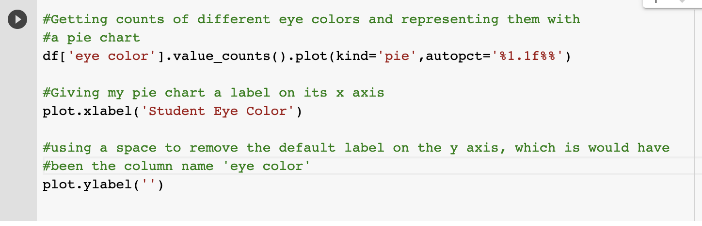
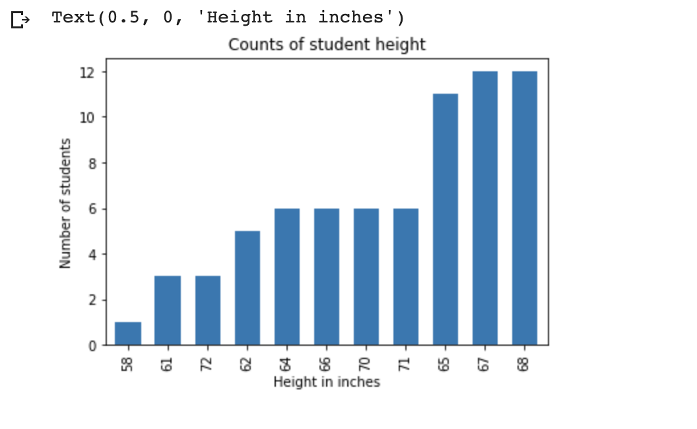

**Google Colab and our Data**

Given our recent dive into database queries and learning what tools we have available to us to help manage large datasets, we’ve learned a little SQLite, SQL commands, and how to use the [DB Browser](https://sqlitebrowser.org/) client to help manage our database projects. Aside from the DB Browser, we did most of our work from the command-line in our CS50 IDEs. But how do we share our work, aside from pushing code to GitHub (we’ve done this when we submitted CS50 problem sets), or sharing our CS50 IDE workspaces?

This is where [Google Colab](https://colab.research.google.com/notebooks/intro.ipynb#scrollTo=GJBs_flRovLc) and the Python programming language can be useful, especially when working on any sort of data science or machine learning project, or when we want to visualize our data with charts and graphs. The tutorial I created will help us scratch the surface, but if you have further curiosity about using Google Colab in your own machine learning projects, I recommend you check out their [Machine Learning Crash Course](https://developers.google.com/machine-learning/crash-course/).

**Steps To Take:**

1. First [watch this video](https://www.youtube.com/watch?v=inN8seMm7UI) to get an understanding of what Google Colab is. Essentially, it’s an interactive notebook that lets you write code and documentation, and include data visualizations, that you can easily share via Google Drive or GitHub. Google Colab uses something called [Markdown](https://www.markdownguide.org/basic-syntax/) to style your text cells and documentation.

2. Next, go to [Google Colab](https://colab.research.google.com/notebooks/intro.ipynb#scrollTo=GJBs_flRovLc) and create a new notebook. We’re going to learn a little Python in this notebook that will help us visualize some of that [data contained in the sample data set](https://docs.google.com/spreadsheets/d/1CEeJSr-MXmkDUip-NgNHf-4heiKZEeaV3WIVkzzTfXU/edit?usp=sharing) we used for our SQL tutorials. If you don’t still have that .csv file downloaded to your computer, you’ll need to download it again. Rename the file to APCS.csv.

3. Let’s start with the basics and just add a text cell to explain what we plan on doing inside this Colab notebook. If you rename your notebook like I did, just make sure you keep the .ipynb extension. Then just click on the ‘+’ sign next to ‘Text’ to add that text cell.

Then let’s just add our Markdown to explain what we plan to do. Notice how I used the ‘#’ to indicate which text was my heading, and then just regular text to indicate my paragraph text. The [Markdown guide](https://www.markdownguide.org/basic-syntax/) is really helpful for learning that syntax.

4. Time to add a code cell. You can add one the same way that you added a text cell.

In the code cell, we first want to import any files we plan on using, like the .csv file we have downloaded. Type what you see in the screenshot below, and choose your .csv file when prompted.

If your file uploads correctly, you should see this:

5. Now we have to add another code cell to add our Python libraries that we plan on using. Two very useful libraries are [pandas](https://pandas.pydata.org/) (a data analysis library) and [matplotlib](https://matplotlib.org/) (a visualization library). We’ll also use the [io](https://docs.python.org/3/library/io.html) library which will let us import our .csv file (and any others we want to work with). 

After you type what you see in the window above, click the arrow icon in the top left to run that cell, and you should now see the following:

This means our data loaded!

6. Ok, let’s try creating some basic data visualizations. Before we do that, let’s add another text field to indicate that our data visualizations will have their own section in our notebook.

7. Next, I am going to add another code cell so I can double check that the columns in my .csv file imported correctly. Typing and running:

should produce:

8. Now, I am actually going to create my first data visualization! Say I want to get counts of different eye colors, and I wanted to represent those counts in a pie chart. I would need to add another code cell, and type the following:

When I run this cell, I should see:

There are also ways to change the colors and labels of your pie pieces, as well as make certain wedges of your pie chart stand out. For more information on how to do this, you might want to [read this article](https://medium.com/@kvnamipara/a-better-visualisation-of-pie-charts-by-matplotlib-935b7667d77f).

9. Let’s try representing hair color in a bar graph. To do that, we need to add another code cell and type the following:

And when we run that cell, we should see a nice bar graph that looks like:

**What else can we do in Google Colab?**

1. If you guessed database queries, you’re right! Let’s add another text window to indicate our next plan.

2. First we need to import our data, as it is housed in the sampledata.db database we created in our CS50 IDE during part 1 of our SQLite tutorial. To do that, we must first download that sampledata.db file from our CS50 IDE. 

Once we’ve done that, we need to use the same files_upload() function we used earlier in this Google Colab tutorial. Add another code window and type the following:

Run that cell to ensure that your sampledata.db file uploaded successfully.

3. Now let’s see if we can run a database query. Just like we imported the pandas and matplotlib libraries earlier, if we want to write some database queries, we also have to import the sqlite3 library.

Say I wanted to get a frequency count of the number of students in the sampledata database who are 35. I would need to create a new cell window and type the following (pay close attention to the comments to help you understand what is going on...Python syntax is a little different than C):

When I run that cell, I should see the following:

Meaning there are 5 people in our database who are 35!

4. Now let’s say I want to get counts for each distinct height measurement in the database. I would need to add another cell window, and type the following:

 

And I should see the following:

5. Now let’s make a bar graph of those distinct heights, so we can eyeball the most commonly recorded heights in the database of students. We need to add another code cell and type the following:

And our bar chart should look like:

So to summarize, what conclusion can we draw from this bar chart? Looks like the greatest number of students per category are either 5’7" or 5’8”. 

**Finals Steps:**

If you were able to get yourself through this tutorial start to finish, give yourself a pat on the back for learning a new tool (Google Colab) in a new language (Python)! I saved mine to my GitHub, and I suggest you do the same...it’ll make you feel like a real "developer" :) And you’ll have it in a spot you can easily share with others should you want to show off your new skills, or revisit for a future project (I can envision some of you creating Science Fair projects using Google Colab, or [Jupyter Notebooks](https://jupyter.org/)...).

Here’s how you save it to GitHub (follow the prompts):

And here’s what it will look like in your GitHub repository once you’ve saved it:

By default, you may already have a repo in GitHub that you can save to, but if not, here are the [directions to create one](https://help.github.com/en/github/getting-started-with-github/create-a-repo). And then once you have a repository, you can [create a branch](https://help.github.com/en/github/collaborating-with-issues-and-pull-requests/creating-and-deleting-branches-within-your-repository) which is where your Google Colab notebook will save to. If you don’t save your notebook to GitHub, it will still be saved in Google Drive, and you can easily save it that way.

Nice work!

